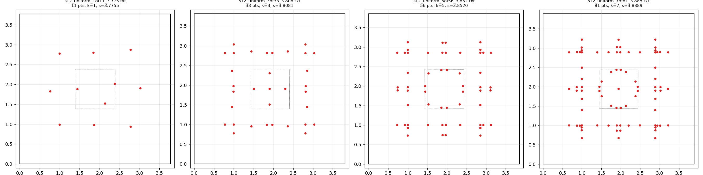

# Uniform (unweighted) certificates for s(12)

A *uniform certificate* `(k, m, s)` is a set of `m` points in `[0, s]^2` such that every closed
unit square inside the container, at every angle, contains at least `k` of them.  With
`m <= 12k - 1` it proves `s(12) >= s`: twelve squares with disjoint interiors would need `12k`
points.  In the repo's certificate format it is a file with every weight `1/k` (weight
denominator `W = k`, every numerator `1`), and it is checked by exactly the same verifier as
the weighted certificate.  This directory asks what lives in this purely combinatorial family.

Everything below was produced in one ~2h15m session on a 32-core machine (2026-08-25).

## Results

All nine certificates verify with `verify <cert> 12 N 32 0` at `N = 2000` and `N = 8000`,
with `python3 xcheck.py <cert> 2000 --all --n 12` (every angle bin), and round-trip through
`export_points.py`.  Each file is written *at* its critical container: `scale_to_critical.py
--n 12` returns the file's own `D` (log: `search/uniform/finalize_log.txt`, regenerated by
`search/uniform/finalize_all.sh`).  The `s` column is therefore the critical `s`.

| k | m | 12k-1 | m/k | s (exact) | s | symmetry | file | structure |
|---|---|---|---|---|---|---|---|---|
| 1 | 11 | 11 | 11.00 | 185/49 | 3.775510 | none | `s12_uniform_1of11_3.775.txt` | 3x3 grid on the lines x,y ~ {1, s/2, s-1} (Stromquist's grid) + 2 points near the centre |
| 2 | 23 | 23 | 11.50 | 2701/717 | 3.767085 | none | `s12_uniform_2of23_3.767.txt` | `#` skeleton (a 21-point D4 set + 2 points, then polished without symmetry) |
| 3 | 33 | 35 | 11.00 | 5000/1313 | 3.808073 | D4 | `s12_uniform_3of33_3.808.txt` | `#`: 8 points on each outer line, cross of 5 at the centre |
| 4 | 45 | 47 | 11.25 | 29600/7803 | 3.793413 | D4 | `s12_uniform_4of45_3.793.txt` | `#` + 8-ring (r ~ 0.39) + centre |
| 5 | 56 | 59 | 11.20 | 7600/1973 | 3.852002 | D4 | `s12_uniform_5of56_3.852.txt` | the shipped 56-point set, re-positioned (was 3.819); `#` + 8-ring (r ~ 0.46) + 4 on the diagonals |
| 5 | 57 | 59 | 11.40 | 3040/789 | 3.852978 | D4 | `s12_uniform_5of57_3.852.txt` | previous + centre point |
| 6 | 69 | 71 | 11.50 | 15000/3931 | 3.815823 | D4 | `s12_uniform_6of69_3.815.txt` | `#` + 8-ring (r ~ 0.44) + 4 at r ~ 0.56 + centre |
| 7 | 81 | 83 | 11.57 | **35/9** | **3.888889** | D4 | `s12_uniform_7of81_3.888.txt` | `#` + 16-point ring (r ~ 0.48–0.50) + centre |
| 8 | 93 | 95 | 11.63 | 500/131 | 3.816794 | D4 | `s12_uniform_8of93_3.816.txt` | `#` + 12 inner points on three 4-rings (r ~ 0.27, 0.43, 0.51) + centre |

`m/k` is the number of points per unit of `k`; the argument needs `< 12`.  With full D4
symmetry (orbits of size 8, 4 on a mirror line, 1 at the centre) `m ≡ 0, 1 (mod 4)`, so the
largest usable `m` is `12k - 3`, which is what the D4 rows use (the 56-point row is the
shipped set, one short).  For `k = 1, 2` the search was run without symmetry so that all
`12k - 1` points are available.

Reference points: the previous published bound `2 + 4/sqrt5 = 3.788854` (Stromquist, from
`n = 11`), the shipped uniform certificate `760/199 = 3.819095`, and the weighted 788-point
certificate `3920/997 = 3.931795`.



(`uniform_certs.png`: k = 1, 3, 5, 7; `s12_56points_structure.png`: the shipped 56-point set
next to a first k = 3 certificate.  Both made by `plot_cert.py`.)

## What is interesting (and what is not)

* **`k = 7, m = 81` at `s = 35/9 = 3.8889`.**  Eighty-one points, seven in every unit square,
  in a square of side 35/9; twelve disjoint squares would need 84.  This is the best uniform
  certificate found, 0.10 above Stromquist's bound and 0.043 below the weighted certificate's
  3.9318 — the weighted LP buys surprisingly little over "every square contains 7 of these 81
  points".  The fraction 35/9 is an accident of the integer bisection in `D` (`K = 30800`,
  `D_crit = 7920`), not structural.  It is still one sentence a human can read, and a
  candidate for a `native_decide`-style Lean proof — 81 points, 7 per square.
* **The shipped 56-point set was far from critical in position space.**  Its combinatorial
  structure is unchanged, but moving the points (same D4 orbit types, same `k = 5`, same 56
  points) takes it from 3.819 to 3.852; adding the centre point gives 3.853.  So the
  README's "scales to 760/199" understates what those 56 points can do by 0.033.
* **The common structure is a `#`.**  Every certificate found, for every `k`, lives on the
  same skeleton: three vertical and three horizontal lines at `x, y ≈ 1, s/2, s-1` — the outer
  lines exactly one unit from the boundary, the centre line usually split into a close pair
  (`s/2 ± 0.04`) — with the points strung along the outer lines at spacing ≈ 0.45, doubled or
  tripled near the crossings, with short overhangs (≈ 0.25) beyond the outer crossings, plus a
  small ring around the centre (radius 0.4–0.5; 4, 8, 12 or 16 points depending on `k`) and,
  for odd `m`, the centre itself.  The `k = 1` set is exactly Stromquist's 3x3 grid on those
  lines (his spacing is `2/sqrt5 = 0.894 ≈ s/2 - 1`) plus two extra points near the centre.
  The reason a lattice cannot work is a density count: the count in a unit square must be
  `>= k` everywhere, while a lattice of spacing `g` gives `≈ k` only if `g ≈ 1/sqrt k`, i.e.
  `≈ k s^2 ≈ 14.4k` points, more than `12k`.  Points on the six lines of a `#` have the
  property that any unit square, at any angle, crosses at least one line of each direction
  and captures a unit-length window of it — and the corners and the ring handle the rest.
  So the structure is *describable*; the exact coordinates are not (they are the output of a
  local search, with the near-crossing points split by a few hundredths).
* **Pure `#` is not enough.**  Restricting the candidate points to exactly six lines
  (`ilp_uniform.py --lines`) gives `k = 3`: 32 points at 3.75 in 5 s, and `k = 5`: 57 points
  at 3.70, but nothing at 3.80 for `k = 5` even with the two near-corner lines doubled; the
  polished sets need "thick" lines (pairs 0.03–0.07 apart) to get past ~3.75.
* **`k = 1`: pure hitting sets do not reach Stromquist.**  Eleven points give 3.7755, below
  `2 + 4/sqrt5 = 3.7889`.  His 3x3 grid alone (9 points, spacing `2/sqrt5`, outer lines one
  unit from the boundary) is *not* an unavoidable set for tilted squares — `runs/stromquist_grid9.txt`
  is rejected with a 45°-ish square containing 0 points — so his 10-point bound rests on extra
  case analysis for tilted squares, not on point-hitting alone.  (Our 3.7755 is what the
  search found, not a proven optimum for 11 points.)
* **The small-`k`, small-`m` corners asked for in the task are not there.**  `(k = 2, m = 23)`
  gives 3.767 and `(k = 3, m = 35)` gives 3.808 (the two extra non-symmetric points did not
  help `k = 3` at all); nothing with `k <= 4` reached 3.85.  The smallest `k` at 3.85 is
  `k = 5` (56 or 57 points), and `k = 7` is the striking corner.
* **Non-monotonicity in `k` (6 and 8 below 5 and 7) is almost certainly a search artefact.**
  The `k = 4, 6, 8` chains started from ILP seeds at 3.70–3.75; the grid ILP found nothing at
  3.82–3.85 for them on four different grid spacings, while for `k = 7` one spacing happened to
  admit a feasible 3.85 seed with the ring structure, and that seed polished to 35/9.  Attempts
  to transfer the `k = 7` structure to `k = 6, 8` by dropping / adding twelve points did not
  converge inside the time-box.  A better ILP seed (finer grid, or the ring imposed) would
  probably lift `k = 6, 8` to ~3.89 as well; there is no reason to expect the even `k` to be
  genuinely worse.  Likewise none of the `s` values here is claimed optimal for its `(k, m)`.

## Method

Two stages, both driven by the exact verifier.

1. **Covering ILP with lazy cuts** (`ilp_uniform.py`).  Candidate points on the grid
   `i·s/n`, `i = 0..n` (so the centre and the boundary are candidates), reduced to D4 orbits
   (or C4 / diagonal / no symmetry); one binary variable per orbit, objective = number of
   points (or feasibility only, `--feas`), constraint `m <= mmax`.  Constraints are
   placements: the closed square of half-side 0.499 (just below the verifier's `sigma/2` at
   `N = 2000`) at `(cx, cy, theta)` must contain `>= k` chosen points.  Placements are
   generated lazily: a numpy scan of the current solution over an `(eta, dt) = (0.02, 0.02)`
   lattice (worst cell per 8x8 block), plus the exact verifier's witness placements
   (`verify cert 12 2000 threads 6 witnessfile`, up to 3000 per round).  Repeat until the
   verifier prints VERIFIED or HiGHS proves infeasibility.  Each cut is a (slightly
   strengthened) necessary condition, so "infeasible" is rigorous *for that grid and
   `hcut`* — and grid artefacts are large: `k = 7` is infeasible at 3.80 on the 0.05 grid and
   feasible at 3.85 on the 0.049 grid.  Typical run: 2 s – 10 min (`fine = 0.05`, ~700 orbits);
   `fine = 0.025` (~3000 orbits) took 10 min for `k = 5`; no-symmetry `k = 1` (5300 binaries)
   did not finish in 17 min and was seeded from its unverified snapshot instead.
2. **Polish** (`polish.py`).  Coordinates are integers at denominator ≈ 7900 (the ILP grid
   times 2·ceil(4000/D)).  The state is the list of D4 orbit representatives (or bare points,
   `--sym none`); the objective is the *critical denominator* `D_crit` — the smallest `D` at
   which `verify` (N = 2000) still passes with the integer coordinates fixed, i.e. the largest
   container `K/D` — minimised lexicographically with the number of failing angle bins at
   `D_crit - 1`.  Moves: one representative shifted by up to ±32 (occasionally ±128) grid
   units, staying on its mirror line if it is on one; 3 % "kicks" that relocate one orbit to
   the centre of the worst placement; ties accepted with probability ½.  `--mmax` first fills
   the set up to `12k-3` (`12k-1` without symmetry) by adding orbits at the worst placements,
   or drops the cheapest orbits if the set is too large.  A scored move costs 1–2 verifier
   calls when rejected and ~10 when accepted (0.01–0.05 s each at these sizes), so a chain
   makes 10^4–10^5 verifier calls in 25 minutes.  Every accepted state is a verified
   certificate; the run writes the best one whenever it improves.  Runs are seeded but not
   bit-reproducible (the verifier's witness order is thread-dependent on ties).

Three polish stages were run: stage 1 (25 min) from the ILP seeds with `m` fixed; stage 2
(30 min) from the stage-1 results with fill-up to the maximal `m` and kicks, two seeds each,
plus no-symmetry chains for `k = 1, 2, 3, 5, 7, 8`; stage 3 (25 min) re-seeded the best of
each `k` and tried cross-`k` transfers (which failed).  Improvement typically saturates after
5–10 minutes of a chain; new seeds and the fill-up step were what kept moving.

## Reproduce

```sh
cd verify && cargo build --release && cd ..
mkdir -p runs
# 1. ILP seeds (28 runs in parallel, 1 core each; 2 s .. 30 min)
sh search/uniform/ladder.sh 0.05 900 "2 3 4 5 6 7 8" "3.70 3.75 3.80 3.85"
sh search/uniform/ladder.sh 0.05 900 "1" "3.60 3.65 3.70 3.75"          # --sym none for k=1
python3 search/uniform/ilp_uniform.py 5 3.8 --fine 0.025 --tag t5b --tl 600
# structure experiments: points only on the # lines
python3 search/uniform/ilp_uniform.py 3 3.75 --fine 0.01 --lines 0.99,1.885 --feas --tag L3
# 2. polish (stage 1: 1500 s, 2 verifier threads, seed 1) -- one per seed certificate
sh search/uniform/polish_launch.sh 1500 2 1 certificates/s12_56points_3.8.txt runs/uni_k7_s3.85_f0.05.txt ...
# stage 2 / 3 exactly as launched (file names are the stage-1 / stage-2 outputs):
sh search/uniform/stage2.sh
sh search/uniform/stage3.sh
# 3. canonicalise, install, and check (verify N=2000/8000, xcheck --all, json, scale_to_critical)
python3 search/uniform/canon.py runs/pol_....txt
sh search/uniform/finalize_all.sh
# critical scaling of any of them (already at the critical D):
python3 search/scale_to_critical.py certificates/s12_uniform_7of81_3.888.txt --n 12 --lo 7880
```

`status.sh` prints a one-line status of every run; `critical.py` is a stand-alone critical
scaling that also writes the scaled file; `plot_cert.py` draws certificates and lists their
distinct coordinates.

Wall times (32 cores, everything heavily oversubscribed — load ~60–100): ILP ladder ≈ 30
min wall for all 28 + extras; polish stages 25 + 30 + 25 min; final checks < 1 min per
certificate (`verify` 0.02–0.5 s, `xcheck --all` 0.5–2 s).  Total ≈ 2h15m including
development of the scripts.

## Files

| file | what |
|---|---|
| `ilp_uniform.py` | covering ILP with lazy placement cuts (grid / symmetry / `--lines` / `--near` / `--feas`) |
| `polish.py` | verifier-driven local search on the point positions; fill / drop to a target `m`; kicks |
| `critical.py` | critical scaling that writes the scaled certificate and re-checks at N = 2000, 8000 |
| `canon.py` | container fraction to lowest terms, `D` reduced by the gcd, points sorted |
| `finalize.sh`, `finalize_all.sh`, `finalize_log.txt` | install + all checks, and their output |
| `ladder.sh`, `polish_launch.sh`, `stage2.sh`, `stage3.sh`, `wait_polish.sh`, `status.sh` | launchers / bookkeeping used in the session |
| `plot_cert.py`, `uniform_certs.png`, `s12_56points_structure.png` | pictures |
